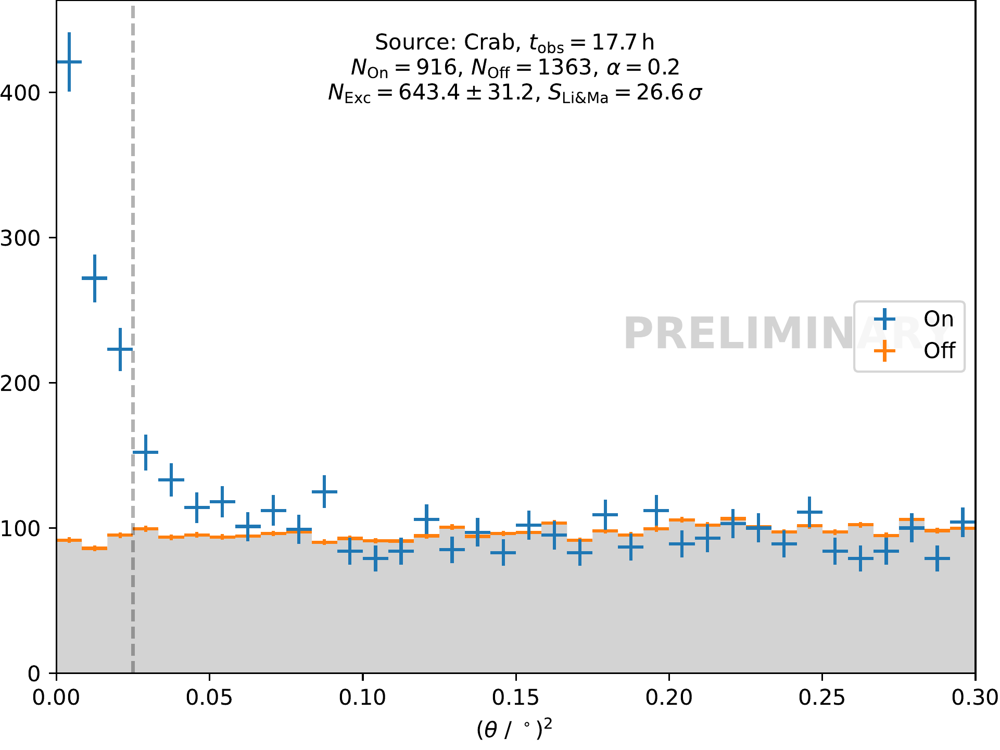

# open_crab_sample_analysis

Sample Gamma Analysis on our Open Crab Sample


## Software installation

Besides a working python installation, you only need `curl` and `make`.

For python, we recommend anaconda, download here: https://www.anaconda.com/download

* After installing, create a new environment for the FACT analysis:

```
$ python -m venv .venv
```


Activate the virtualenv
```
$ . .venv/bin/activate
```


* Install the  requirements

```
(venv) $ pip install -r requirements.txt
```

* run the analysis
```
(venv) $ make
```

This should be the result stored in ``build/theta2_plot.pdf`


